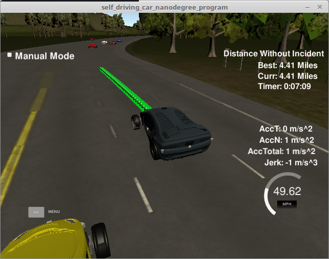
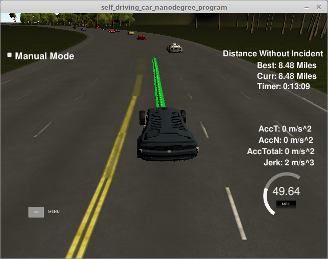

# CarND-Path-Planning-Project
Self-Driving Car Engineer Nanodegree Program


## Goals
In this project the goal is to safely navigate around a virtual highway with other traffic that is driving +-10 MPH of the 50 MPH speed limit.
The car's localization, sensor fusion data and a sparse map list of waypoints around the highway is provided.
The car should try to go as close as possible to the 50 MPH speed limit, which means passing slower traffic when possible, note that other cars will try to change lanes too.
The car should avoid hitting other cars at all cost as well as driving inside of the marked road lanes at all times, unless going from one lane to another.
The car should be able to make one complete loop around the 6946m highway. Since the car is trying to go 50 MPH, it should take a little over 5 minutes to complete 1 loop.
Also the car should not experience total acceleration over 10 m/s^2 and jerk that is greater than 10 m/s^3.


### Reflection

The first approach to implement this project was to use as starting code the behavior planner given in the classroom which also contained two cost functions.
The cost functions were discarded because did not seem to be very useful to this project since there is no goal lane and the choices of trajectories can be easily done by comparing the velocity of each trajectory and choosing the fastest.

It was noticed that all other cars around may change their velocity and change lanes very randomly and abruptly, probably even exceeding the acceleration and jerk limits imposed to the ego.
Therefore the best results came when using a reference velocity and not the ego velocity provided by the simulator.
Because of the choice of using a spline for smoothing the trajectory (which worked very fine for this project)
the generated trajectory from the behavior planner needed only to calculate a desired new velocity and lane and could ignore the rest of the kinematics for the next time step, however for real situation it would probably better to calculate a jerk minimizing trajectory instead of the spline for smoothing.
There is still room for improvement in the choice of the best trajectory and one possible improvement could be to choose not only the lane that allows the ego to drive faster but that also allows it to drive faster for longer time.
This scenario happens when the ego is in the middle lane and chooses one lane left or right where it can go faster for a short period only whereas if choosen the other lane it might be able to drive there for longer time until the next car ahead is found.
This code is able to run at least one complete loop without incidents as can be seen in the screen shot bellow:





Next sections give an overview of how the code is structured and how to run it.

##### Finite state machine (FSM)
The FSM implemented has 3 states: Keep Lane (KL), LCR (Lane Change Right) and LCL (Lane Change Left).

The FSM is implemented in vehicle.cpp in ```vector<string> Vehicle::successor_states()```, lines 57-73.

This function provides the possible next states given the current state for the FSM.
Starting in KL state, the possible transitions are LCL or LCR and in case they are chosen they can only transition back to KL.
There were originally 2 additional states in the behavior planner code form classroom, Prepare Lane Change Right (PLCR) and Prepare Lane Change Left (PLCL).
For this project it was decided that these states should not be considered as they added additional complexity and did not bring improvement for this project.

At each timestep a trajectory is calculated for the next possible states.
However a state transition from KL to LCL or from KL to LCR may not be possible because of other vehicle occupying the desired destination.
In that case no trajectory is calculated and the trajectory defaults to KL.

For the calculated trajectory change the trajectory with higher velocity will be chosen: ```if(trajectory[0].v>best_speed+0.1 && this->ref_v > 13.4)```, but only if actual velocity is higher than 13.4 m/s (close to 30 mph).

The function where this decision is calculated is ```vector<Vehicle> Vehicle::choose_next_state(map<int, vector<Vehicle>> &predictions)``` in vehicle.cpp, lines 35-55.


##### Other Cars Predictions Generation

The ```class Road``` in Road.h was created to store the data provided by the simulator for all other cars on the road as well as to store their predictions.
In each time step the sensor fusion data is saved to the road object ```road.add_car(sensor_fusion[i]);``` (main.c lines 124-127)
and the predictions for the cars around are also updated ```road.update_predictions(horizon, prev_size)``` (main.c line 131)


##### Trajectory Generation

For generating a new trajectory, the state of the FSM is necessary as well as a map of vector<Vehicle> predictions which contain the predictions for where all other cars will be.
The function is ```vector<Vehicle> Vehicle::generate_trajectory(string state, map<int, vector<Vehicle>> &predictions)``` in vehicle.cpp, lines 75-88.

Given a KL state or one of the two change lane states, the generate_trajectory function will call ```keep_lane_trajectory(predictions)``` or ```lane_change_trajectory(state, predictions)``` for the respective trajectory generation.

The ```vector<Vehicle> Vehicle::keep_lane_trajectory(map<int, vector<Vehicle>> &predictions)``` in vehicle.cpp, lines 110-120 will return the next time step velocity allowed on the same lane.

The ```vector<Vehicle> Vehicle::lane_change_trajectory(string state, map<int, vector<Vehicle>> &predictions)``` in vehicle.cpp,
lines 122-146, will check if there are any predictions of vehicles in the desired lane, with a margin of 30 meter from the ego (to front and back), and as long as the lane is free, it will provide the new velocity for that lane, 

The returning parameters of these functions are of type ```vector<Vehicle>``` due to the original behavior planner code,
however for this project only one Vehicle object is used and only it's velocity and lane variables will later be used to calculate the set of x,y points to be given to the simulator, indicating where the ego should be on the next time steps.

Next time step velocity for a desired lane will be calculated in ```float Vehicle::get_kinematics(map<int, vector<Vehicle>> &predictions, int lane)``` in vehicle.cpp, lines 90-107.
This function calculates the minimum allowed velocity for the ego given the max acceleration constraints, maximum velocity in front and maximum speed limit.


The actual trajectory of x,y points that will be given to the simulator is calculated in main.c. 
For a smooth path generation an interpolation is done with the spline.h library. 
A total of 5 x,y pair of points are passed on to the spline for interpolation: 2 past points and 3 future points.
Lines 137-162 in main.c define the past two x,y pair of points to use, and lines 164-184 define the 3 future points.

For the 3 future points the helpers.h function getXY is used:
```vector<double> getXY(double s, double d, const vector<double> &maps_s, const vector<double> &maps_x, const vector<double> &maps_y)```
This function transforms Frenet (s,d) to Cartesian (x,y) coordinates.
The 3 future points are 30, 60 and 90 ahead of the current car's S position and the respective lane number is given from the selected new trajectory.
Example from line 171 in main.c :  ``` next_wp1 = getXY(car_s + 60, 2 + 4*next_trajectory[0].lane, map_waypoints_s, map_waypoints_x, map_waypoints_y);```
Because the sensor fusion data from the simulator provides the d coordinate in Frenet and not the lane number, the function ```void Vehicle::set_lane(double d)``` is used to calculate the other cars lane number.
The conversion from lane number back to d coordinate is done with (2+4* lane_num) = d.
d is 0 at the center of the road and counts positive to the right side where the ego is driving.
Each lane is 4 m wide so the middle of the 2nd lane (middle lane ) has d=6.


The previous points generated for the ego and that the simulator did not yet process are in ```previous_path_x``` and ```previous_path_y``` vectors and they are used before new points are added. This is done in lines 194-197 in main.c.
The new x,y points are points taken from the interpolated list of points (with the spline, lines 186-188 in main.c). 
The spacing of these points every time step is what will define the ego's velocity. 
Knowing that the distance can be calculated by ```N_points * time step(0.02s) * velocity = distance```, 
a pre-defined distance of 30 meters is used and for the desired velocity(previously calculated from trajectory generation) 
the N_points are calculated ```double N = target_dist/(0.02*my_car.ref_v); //velocity in m/s already``` line 206, main.c
The number of new points is 50 minus the size of the previous list of points given to the simulator, line 204 in main.c

   
### Simulator.
You can download the Term3 Simulator which contains the Path Planning Project from the [releases tab (https://github.com/udacity/self-driving-car-sim/releases/tag/T3_v1.2).  

To run the simulator on Mac/Linux, first make the binary file executable with the following command:
```shell
sudo chmod u+x {simulator_file_name}
```

#### The map of the highway is in data/highway_map.txt
Each waypoint in the list contains  [x,y,s,dx,dy] values. x and y are the waypoint's map coordinate position, the s value is the distance along the road to get to that waypoint in meters, the dx and dy values define the unit normal vector pointing outward of the highway loop.

The highway's waypoints loop around so the frenet s value, distance along the road, goes from 0 to 6945.554.

## Basic Build Instructions

1. Clone this repo.
2. Make a build directory: `mkdir build && cd build`
3. Compile: `cmake .. && make`
4. Run it: `./path_planning`.

Here is the data provided from the Simulator to the C++ Program

#### Main car's localization Data (No Noise)

["x"] The car's x position in map coordinates

["y"] The car's y position in map coordinates

["s"] The car's s position in frenet coordinates

["d"] The car's d position in frenet coordinates

["yaw"] The car's yaw angle in the map

["speed"] The car's speed in MPH

#### Previous path data given to the Planner

//Note: Return the previous list but with processed points removed, can be a nice tool to show how far along
the path has processed since last time. 

["previous_path_x"] The previous list of x points previously given to the simulator

["previous_path_y"] The previous list of y points previously given to the simulator

#### Previous path's end s and d values 

["end_path_s"] The previous list's last point's frenet s value

["end_path_d"] The previous list's last point's frenet d value

#### Sensor Fusion Data, a list of all other car's attributes on the same side of the road. (No Noise)

["sensor_fusion"] A 2d vector of cars and then that car's [car's unique ID, car's x position in map coordinates, car's y position in map coordinates, car's x velocity in m/s, car's y velocity in m/s, car's s position in frenet coordinates, car's d position in frenet coordinates. 

## Details

1. The car uses a perfect controller and will visit every (x,y) point it recieves in the list every .02 seconds. The units for the (x,y) points are in meters and the spacing of the points determines the speed of the car. The vector going from a point to the next point in the list dictates the angle of the car. Acceleration both in the tangential and normal directions is measured along with the jerk, the rate of change of total Acceleration. The (x,y) point paths that the planner recieves should not have a total acceleration that goes over 10 m/s^2, also the jerk should not go over 50 m/s^3. (NOTE: As this is BETA, these requirements might change. Also currently jerk is over a .02 second interval, it would probably be better to average total acceleration over 1 second and measure jerk from that.

2. There will be some latency between the simulator running and the path planner returning a path, with optimized code usually its not very long maybe just 1-3 time steps. During this delay the simulator will continue using points that it was last given, because of this its a good idea to store the last points you have used so you can have a smooth transition. previous_path_x, and previous_path_y can be helpful for this transition since they show the last points given to the simulator controller with the processed points already removed. You would either return a path that extends this previous path or make sure to create a new path that has a smooth transition with this last path.


---

## Dependencies

* cmake >= 3.5
  * All OSes: [click here for installation instructions](https://cmake.org/install/)
* make >= 4.1
  * Linux: make is installed by default on most Linux distros
  * Mac: [install Xcode command line tools to get make](https://developer.apple.com/xcode/features/)
  * Windows: [Click here for installation instructions](http://gnuwin32.sourceforge.net/packages/make.htm)
* gcc/g++ >= 5.4
  * Linux: gcc / g++ is installed by default on most Linux distros
  * Mac: same deal as make - [install Xcode command line tools]((https://developer.apple.com/xcode/features/)
  * Windows: recommend using [MinGW](http://www.mingw.org/)
* [uWebSockets](https://github.com/uWebSockets/uWebSockets)
  * Run either `install-mac.sh` or `install-ubuntu.sh`.
  * If you install from source, checkout to commit `e94b6e1`, i.e.
    ```
    git clone https://github.com/uWebSockets/uWebSockets 
    cd uWebSockets
    git checkout e94b6e1
    ```